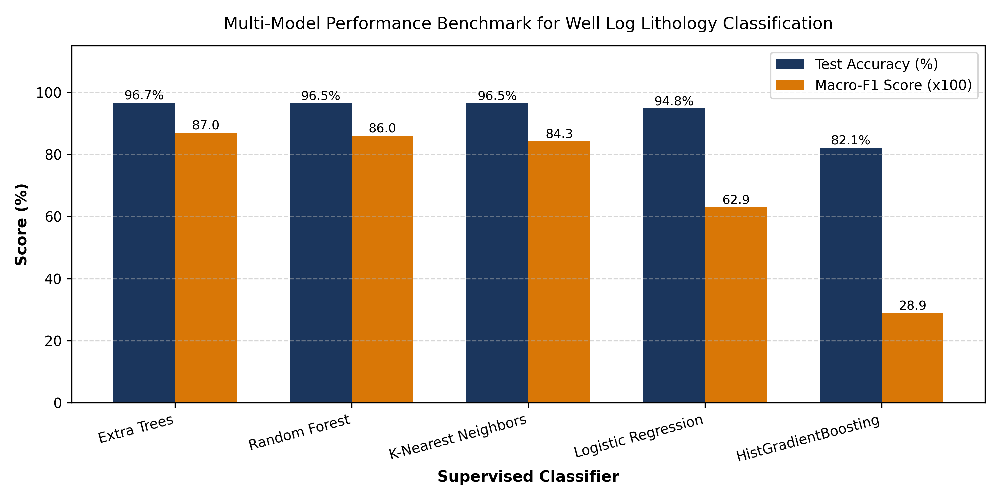
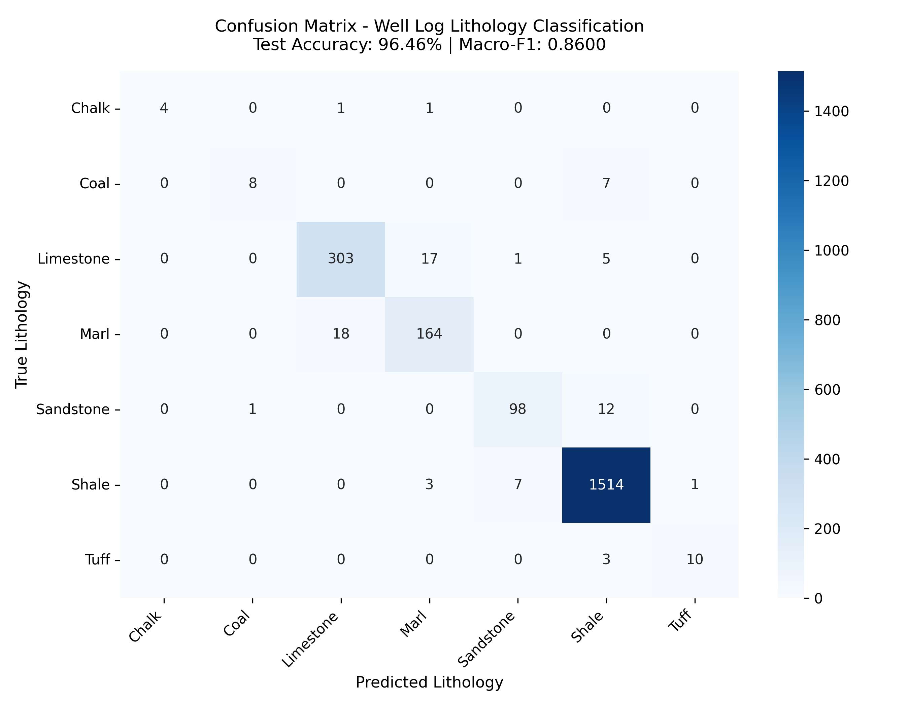
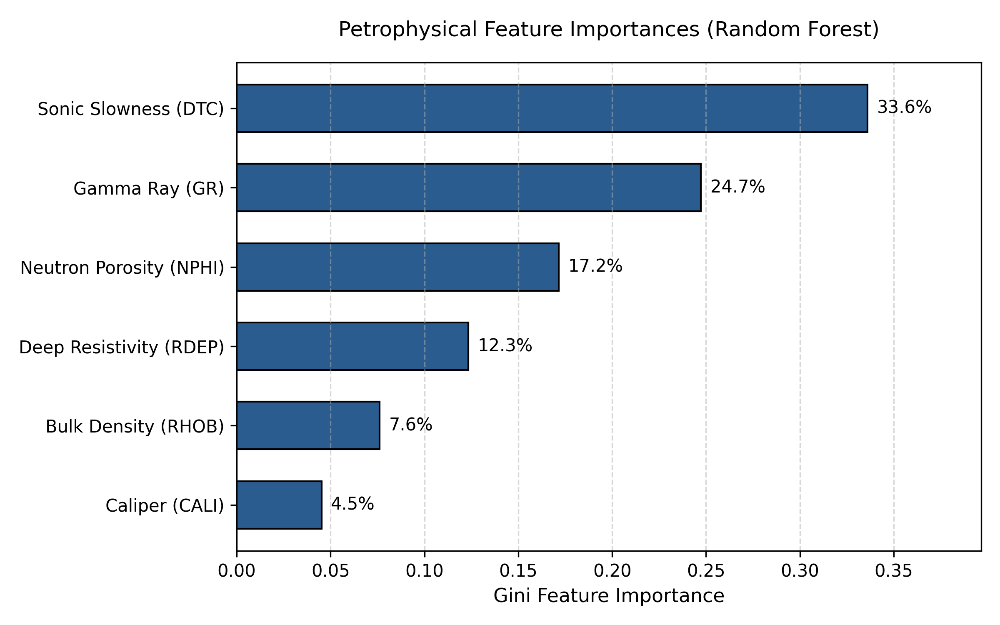
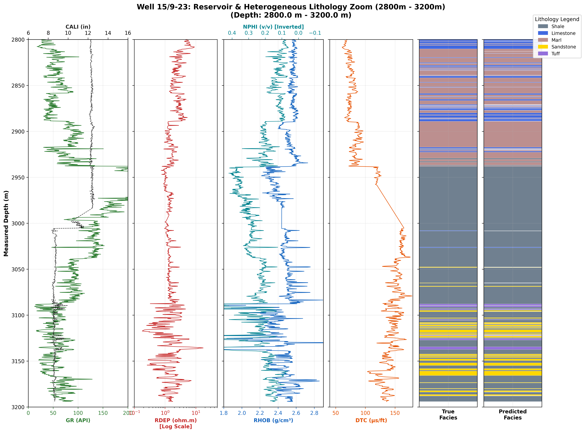

# Automated Lithology Classification from Subsurface Well Logs

[](https://www.python.org/downloads/)
[](https://scikit-learn.org/)
[](https://streamlit.io/)
[](https://github.com/bolgebrygg/Force-2020-Machine-Learning-competition)
[]()
[]()

An end-to-end, production-grade Machine Learning pipeline to classify discrete subsurface lithology facies directly from continuous wireline geophysical well logs. Trained and benchmarked on North Sea Well **15/9-23** from the **FORCE 2020 Benchmark Dataset**.

---

## 📌 Project Highlights

- **96.46% Test Accuracy & 0.8600 Macro-F1 Score**: Rigorously evaluated across 7 geological facies categories, heavily penalizing class-imbalance errors.
- **5-Fold Cross-Validation**: Achieved **0.8684 ($\pm 0.0275$)** training stability.
- **Petrophysical Data Cleaning**: Safe outlier handling protecting genuine low-density coal seams ($\text{RHOB} < 1.8\text{ g/cm}^3$) and borehole washout quality indicators ($\text{DCAL} > 2.5\text{ in}$).
- **Interactive Streamlit Web Dashboard**: Real-time sensor query sliders, geological presets, batch CSV inference, and down-hole log viewers.
- **Down-Hole Visual Validation**: Generates standard 6-track composite well logs comparing true geology against machine learning predictions across depth.

---

## 🪨 Geological Facies Schema

The target formation lithology is mapped into a standardized 7-class schema:

| Target Code | Lithology Name | Physical Characteristics | Color Code |
| :---: | :--- | :--- | :---: |
| `0` | **Chalk** | Low GR, moderate-to-high sonic slowness, low density | `#00CED1` |
| `1` | **Coal** | Extremely low bulk density ($\rho_b \approx 1.2-1.6$), high hydrogen index ($\phi_n > 0.50$) | `#1C1C1C` |
| `2` | **Limestone** | Low GR, high bulk density ($\rho_b \approx 2.65-2.71$), fast acoustic transit ($DTC \approx 45-60$) | `#4169E1` |
| `3` | **Marl** | Intermediate clay-carbonate mixture, moderate GR and resistivity | `#BC8F8F` |
| `4` | **Sandstone** | Low GR, porous fluid reservoir, low-to-moderate slowness | `#FFD700` |
| `5` | **Shale** | High natural radioactivity (clay minerals), slow acoustic velocity, high $NPHI$ | `#708090` |
| `6` | **Tuff** | Volcanic ash beds with distinct acoustic slowness and density signatures | `#9370DB` |

---

## 📊 Model Performance & Diagnostics

### Multi-Model Benchmark Comparison

| Model Architecture | Test Accuracy (%) | Macro-F1 | Weighted-F1 | 5-Fold CV Macro-F1 | Training Time |
| :--- | :---: | :---: | :---: | :---: | :---: |
| **Extra Trees Classifier** | **96.65%** | **0.8696** | **0.9659** | **0.8749** | 0.29s |
| **Random Forest Classifier** | **96.46%** | **0.8600** | **0.9640** | **0.8684** | 0.58s |
| **K-Nearest Neighbors (KNN)** | 96.46% | 0.8426 | 0.9640 | 0.8528 | 0.01s |
| **Logistic Regression (Linear)** | 94.77% | 0.6295 | 0.9438 | 0.6735 | 0.14s |
| **HistGradientBoosting** | 82.14% | 0.2895 | 0.7734 | 0.4448 | 3.14s |



### Confusion Matrix Heatmap


### Petrophysical Feature Importances
1. **Compressional Sonic Slowness ($DTC$) (33.61%)**: Primary physical differentiator separating high-velocity carbonates from soft shales.
2. **Gamma Ray ($GR$) (24.74%)**: Distinguishes radioactive clays from clean sandstones and carbonates.
3. **Neutron Porosity ($NPHI$) (17.16%)**: Measures fluid-filled pore space and clay-bound hydrogen.
4. **Deep Resistivity ($RDEP$) (12.34%)**: Evaluates formation fluid salinity and hydrocarbon saturation.
5. **Bulk Density ($RHOB$) (7.62%)**: Governs rock grain density and compaction.
6. **Borehole Caliper ($CALI$) (4.52%)**: Diagnoses borehole rugosity and washouts.



---

## 📉 Down-Hole Composite Well Log Profile

Below is a 6-track composite well log profile generated across the heterogeneous reservoir section ($2,800\text{ m} - 3,200\text{ m}$ depth), showing near-perfect correspondence between true geology and machine learning predictions:



---

## 🚀 Quick Start & Usage

### 1. Installation
Clone the repository and install the dependencies:
```bash
git clone https://github.com/your-username/Automated-Lithology-Classification.git
cd Automated-Lithology-Classification
pip install -r requirements.txt
```

### 2. Run the Full End-to-End Pipeline
Execute data ingestion, cleaning, stratified 80/20 splitting, feature normalization, model training, evaluation, and composite track plotting in a single command (~10 seconds):
```bash
python main.py
```

### 3. Launch the Interactive Streamlit Web UI
Start the live web dashboard in your browser:
```bash
streamlit run app.py
```
Then navigate to `http://localhost:8501` to test real-time predictions, adjust sensor sliders, and run batch CSV predictions.

### 4. Command-Line Inference Tool
Predict lithology for a single depth point:
```bash
python predict.py --gr 35.0 --rhob 2.25 --nphi 0.15 --dtc 72.0 --cali 12.2 --rdep 8.5
```
Or run batch inference on any CSV:
```bash
python predict.py --input test_data.csv --output my_predictions.csv
```

---

## 📂 Repository Structure

```text
├── app.py                                # Interactive Streamlit Web Application
├── main.py                               # Master end-to-end pipeline orchestrator
├── clean_data.py                         # Data cleaning & petrophysical quality filtering
├── split_and_scale.py                    # Stratified 80/20 splitting & StandardScaler
├── train_and_evaluate.py                 # Random Forest training & evaluation metrics
├── plot_lithology_track.py               # 6-track composite well log plotter
├── predict.py                            # Production CLI inference tool
├── compare_models.py                     # Multi-model benchmark script
├── generate_word_report.py               # Generates styled Word report (.docx)
├── Lithology_Classification_Pipeline.ipynb # Complete interactive Jupyter Notebook
├── Final_Project_Report.docx             # Formatted academic project report (Word)
├── Project_Report.md                     # Markdown project report
├── 15_9-23.csv                           # Raw well log dataset (Well 15/9-23)
├── 15_9-23_cleaned.csv                   # Cleaned, non-redundant dataset (10,887 rows)
├── train_data.csv                        # Training partition (8,709 records)
├── test_data.csv                         # Testing partition (2,178 records)
├── random_forest_model.joblib            # Trained Random Forest classifier
├── scaler.joblib                         # Fitted StandardScaler object
├── confusion_matrix.png                  # Confusion matrix heatmap
├── feature_importance.png                # Petrophysical feature ranking chart
├── well_log_full_profile.png             # Full down-hole composite track log
├── well_log_reservoir_section.png        # Zoomed reservoir composite track log
├── model_comparison.png                  # Benchmark bar chart
└── README.md                             # Repository documentation
```

---

## 📜 Academic Attribution
- **Course**: SCOA032 - Subsurface Characterization & Advanced Analytics
- **Dataset Reference**: Bormann, P., et al. (2020). *FORCE 2020 Machine Learning Competition for Lithofacies Prediction*.
